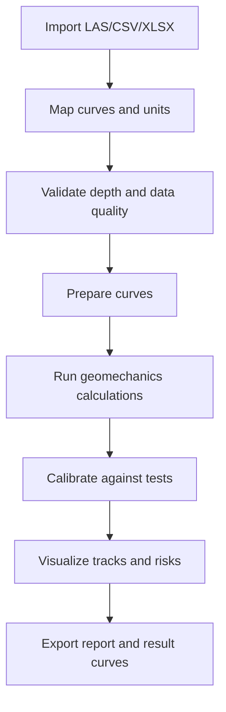

# Architecture

## Цель архитектуры

Архитектура должна отделять физическое расчетное ядро от интерфейса, импорта данных и отчетности. Это позволит независимо развивать модели, тестировать формулы и подключать разные UI: web, desktop, CLI или notebooks.

## Предлагаемые слои

```text
app/
  ui/                 user interface
  workflows/          прикладные сценарии расчета
  core/               расчетное ядро
  io/                 LAS/CSV/XLSX/project import-export
  reports/            отчеты и графики
  validation/         проверки входных данных
tests/
benchmarks/
examples/
docs/
```

## Core

Расчетное ядро должно быть чистым и тестируемым. Функции получают массивы и параметры, возвращают массивы и диагностические сообщения. Внутри core запрещены зависимости от UI.

Основные модули:

- `units`: приведение единиц и соглашения по знакам;
- `curves`: работа с глубинными кривыми;
- `stress`: `Sv`, `Shmin`, `SHmax`, effective stresses;
- `pore_pressure`: hydrostatic, Eaton, user-defined profile;
- `rock_properties`: elastic properties, UCS, friction angle;
- `wellbore_stability`: failure criteria and mud window;
- `calibration`: LOT/FIT/MDT/RFT calibration points;
- `quality`: data checks and warnings.

## Data Model

Минимальные сущности:

- `WellProject`: проект скважины;
- `DepthCurve`: кривая по глубине с units, mnemonic, source;
- `CalculationCase`: набор параметров и выбранных методов;
- `CalibrationPoint`: точка калибровки;
- `ResultCurve`: расчетная кривая;
- `AuditEvent`: запись об операции подготовки данных или расчета.

## Workflow



## Ошибки и предупреждения

Приложение должно различать:

- blocking errors: расчет невозможен;
- warnings: расчет возможен, но результат требует внимания;
- info: диагностические сообщения.

Примеры blocking errors:

- немонотонная глубина;
- неизвестные единицы ключевой кривой;
- несовместимые длины массивов;
- отрицательная плотность;
- недостаточно данных для выбранной модели.

## Тестовая стратегия

- unit tests для каждой формулы;
- integration tests для полного workflow;
- benchmark tests для синтетических кейсов;
- regression tests для реальных или обезличенных скважин;
- visual/snapshot tests для отчетов и графиков после появления UI.

## Версионирование расчетов

Каждый экспортированный результат должен содержать:

- версию приложения;
- hash или id calculation case;
- дату расчета;
- список входных файлов;
- выбранные методы;
- параметры;
- предупреждения.
